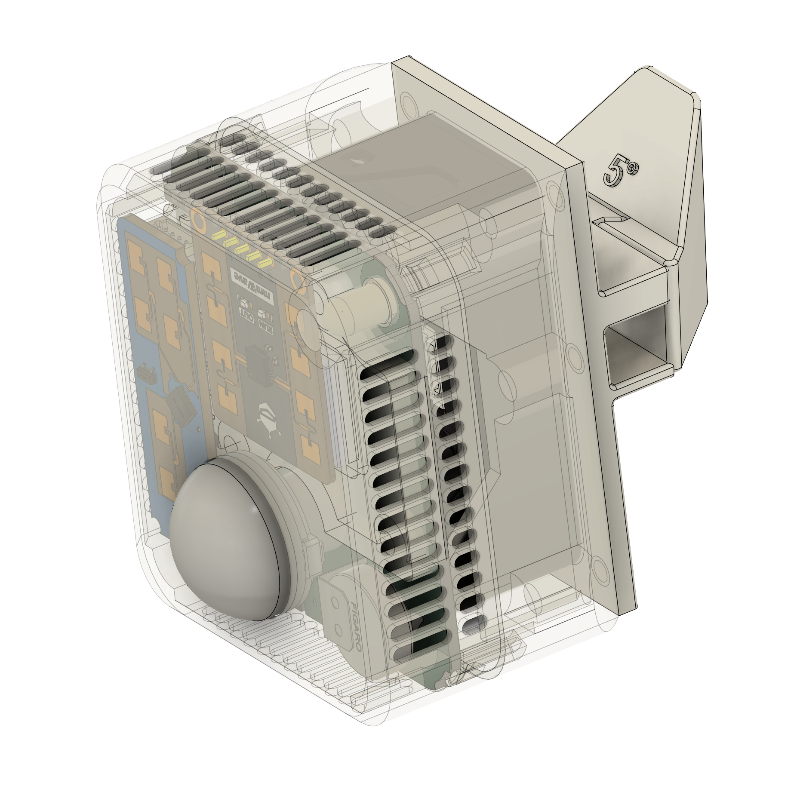
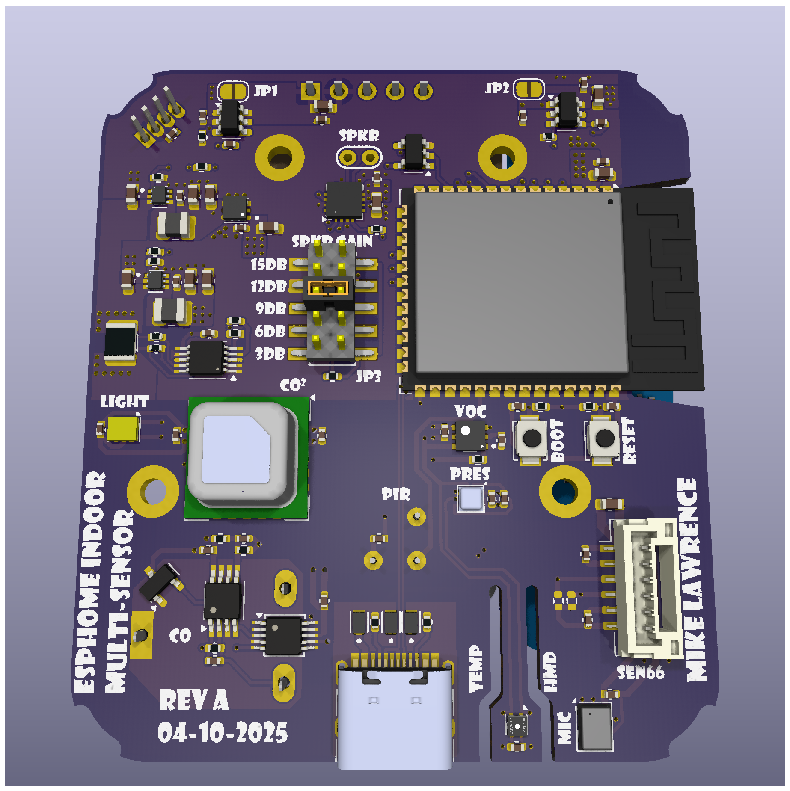
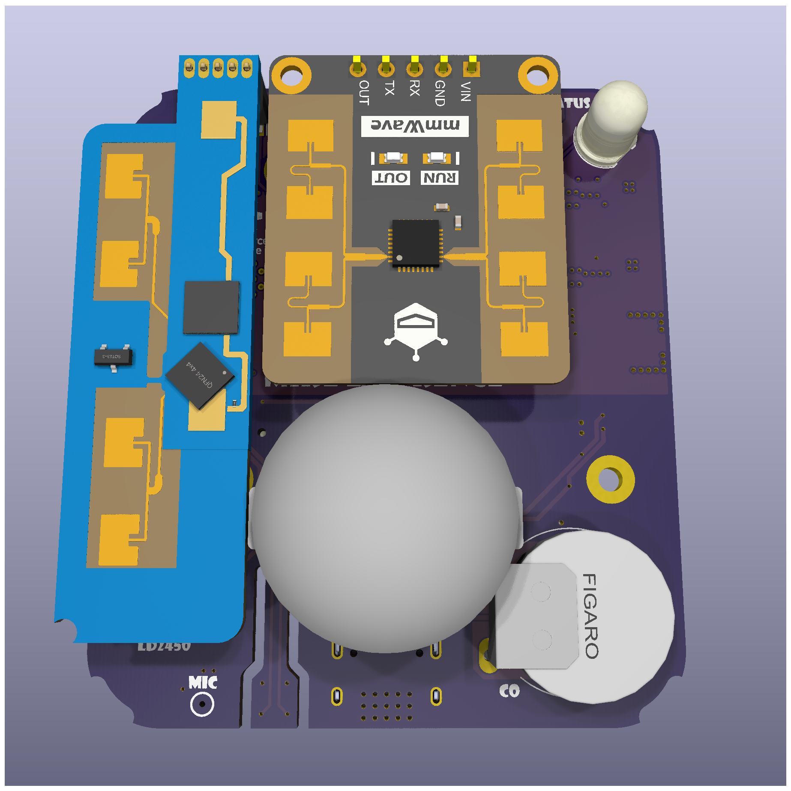

# ESPHome Indoor Multi-Sensor

  
  
  

There are a lot of presence sensors using a combination of PIR and High Frequency Radar Human Presence Detectors to get a combination of quick response and low movement detection like when sleeping. Good examples of these types of sensor are the [Everything Presence One](https://shop.everythingsmart.io/products/everything-presence-one-kit) and [Roomsense IQ](https://www.roomsenselabs.com/). The later has a sensor module that you can add to support all sorts readings like Particular Matter (PM) Carbon Monoxide. But since I like to do everything myself. I started thinking about how I would approach this and more specifically what sensors did I want.

I settled on the following characteristics:

* ESP32-S3
* ESPHome software development
* USB-C Power
* Multiple options for Radar presence detection modules
  - Hi-Link LD2410B
  - Hi-Link LD2450
  - DFRobot C4001 (SEN609 and SEN610)
* PIR (Panasonic)
* Sensirion SEN66 All-in-One (Package A)
  - Temperature
  - Humidity
  - Particulate Matter (PM) 
  - CO₂
  - Volatile Organic Compound (VOC)
  - Nitrogen Oxide (NOX)
* Or individual Sensors (Package B)
  - Sensirion SHT4X Temperature and Humidity
  - Sensirion SCD4X CO₂
  - Sensirion SGP4X VOC and NOX
* Bosch BMP581 Pressure
* Figaro TGS5141 Carbon Monoxide (CO)
* AMS TSL2591 Light
* Microphone for sound levels
* A Speaker for alerts
* INA228 Power and Energy Monitor

## Status
* **Rev -** Has been fabricated and tested. I had JLCPCB fabricate the boards and I self assembled using a Home-Brew reflow oven by [Whizoo Controleo3](https://whizoo.com/). All circuits have been tested and found to be operational. 
* **Rev A** There was an issue with signal integrity on the I2C bus when communicating with the SEN66. To fix the problem I added stronger pullups and a new and dedicated I2C bus to the SEN66. Thus Rev A was born. I have not fabricated Rev A boards since I still have 6 Rev - boards left but the changes are minor and should be fine. Please let me know if you built Rev A and how it went.

## Design Decisions
### ESP32 and ESPHome
ESPHome is closely aligned with Home Assistant. In fact they are the same company. Home Assistant uses ESPHome for some of their hardware like the [Home Assistant Voice Preview Edition](https://www.home-assistant.io/voice-pe/) or [Bluetooth Proxy](https://esphome.io/components/bluetooth_proxy.html). I chose a newer ESP32-S3 for this design which also has Bluetooth support.

This project uses ESP32-S3-WROOM-2-N32R16V which has an enormous 32MB of flash and 16MB of octal PSRAM. These specs are way out of the normal range for an ESP32, so why? First I wanted to be able to store sounds directly on the unit itself mainly so it can sound out alerts even if Home Assistant is not connected. The PSRAM came along with the big Flash but it also has benefits. Sound pressure analysis likes more PSRAM and so does Bluetooth Proxying.

### Sensors
#### Radar based Human Presence Sensors
Both the Hi-Link sensors (LS2410B and LD2450) are supported by ESPHome directly but the DFRobot C4001 is not. I wrote an ESPHome External Component available [here](https://github.com/mikelawrence/ESPHome-Components?tab=readme-ov-file#esphome-c4001-external-component). The board has the LD2410 and LD2450 sharing the same physical space but the DFRobot C4001 can exist next to one of the LD sensors. I added circuitry so that you can choose which sensor to operate electrically. However enabling both simultaneously could result in strange behavior. After using the LD2450 for  bit I realized the the "just released" LD2450 ESPHome component has some short comings. Specifically there is no installation angle or flip-x-axis. So I added them in my version of the LD2450 ESPHome component [here] (https://github.com/mikelawrence/ESPHome-Components?tab=readme-ov-file#esphome-ld2450-external-component).

#### Sensor choices
The [SEN66](https://sensirion.com/products/catalog/SEN66) may be an expensive sensor package but it does it all, Temperature, Humidity, PM, CO₂, VOC and NOX. A tiny fan is primarily used for measuring PM but it also moves air by the temperature and humidity sensors making them fairly responsive. I call this Package A. If you choose not use the SEN66 you can populate the Package B individual sensors ([SHT4X](https://sensirion.com/media/documents/33FD6951/67EB9032/HT_DS_Datasheet_SHT4x_5.pdf), [SCD4X](https://sensirion.com/media/documents/48C4B7FB/67FE0194/CD_DS_SCD4x_Datasheet_D1.pdf) and [SGP4X](https://sensirion.com/media/documents/A056FE9C/61E970C2/Sensirion_Flyer_Gas_Sensors_Web.pdf)) to get Temperature, Humidity, CO₂, VOC and NOX. The only thing missing is PM.

#### Carbon Monoxide
For some reason CO sensors are not as common as CO₂ sensors. Most are expensive and have short life spans. The  Figaro TGS5141 is inexpensive and has a 10-year life span but it isn't a nice all-in-one with I2C interface. You have to add a transimpedance amplifier and then digitize the analog signal. I chose to add an ADS1115 16-bit ADC right next to the transimpedance amplifier instead of running analog signal across the board to the questionable ESP32 built in ADC. The ADS1115 also a has true differential Programmable Gain Amplifier on the input. This reduces the CO sensor circuit complexity. This sensor is not going to be very accurate but detection of CO in even low levels is probably a reason for concern. So even if not a safety sensor it can help.

I verified the CO circuit using CO Bump Gas. It doesn't calibrate, but it will prove that the sensor responds to the presence of CO. I used a small upside down container on my outside bench with the sensor I wanted to test inside. Squirting some bump gas inside with the thin straw showed that 4 out of 5 sensors responded to the gas. The 5'th that didn't respond had a solder bridge between two pins on the transimpedance amplifier. A quick removal of the solder bridge fixed the non-functioning sensor.

> [!WARNING]
> This CO sensor is not rated for safety nor is it particularly accurate. Use at your own risk! I still have UL listed (American) CO detectors as my main line of defense.

#### Pressure and Light
The [BMP581](https://www.bosch-sensortec.com/media/boschsensortec/downloads/datasheets/bst-bmp581-ds004.pdf) pressure sensor is primarily used as a barometric pressure sensor but it is sensitive enough for micro-pressure changes like when a door is closed. Pressure can also be used to compensate the CO₂ sensor in either the SEN6X or the SCD4X. Light is another measurement that may or may not be helpful but I included it. Keep in mind that this measurement is inside an enclosure thus has some significant limitations when it comes to accuracy.

#### Speaker and Microphone
The SEN66 takes up a lot of space so a small speaker is necessary. I choose a flat speaker from [Same Sky](https://www.sameskydevices.com/product/audio/speakers/miniature-(10-mm~40-mm)/cms-251437-24sp-x8) and started playing. My first attempts were pretty, flat, meaning these small speakers don't move a lot of air and in free space they have almost no volume. After doing some research it became clear, the speaker needs a enclosure. I was able to come up with a small 3D printed enclosure attached to the PCB itself. Man what a difference. This 2W speaker kicks some serious butt.

I threw in the microphone to measure sound levels. The intent is listen for noise as additional presence detection.

#### Power and Energy Monitor
The [INA228](https://www.ti.com/lit/ds/symlink/ina228.pdf) power and energy monitor can give instantaneous readings of voltage, current and power but it also measures energy over time (WHr).

### USB-C Power
I'm not using USB-C Power Delivery but I am expecting 5V @ 3A which is readily available if you have the right USB-C Power Brick. The PCB has the appropriate resistors on the CC pins which will request 5V @ 3A from a standard USB-C Power Brick. Testing shows slightly less than 1W for the Package A version and slightly less than 0.9 W for the Package B option as measured by the INA228. Quick measurements show about 8.1kWh/yr for Package A and 7.3kWh/yr for Package B. In Texas that is less than $1 per year.

## Enclosure

  

More information is in the enclosure [README](enclosure/README.md) file.

## Operation
Expect an ESPHome YAML configuration soon.